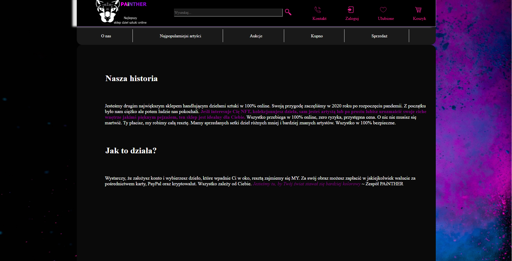
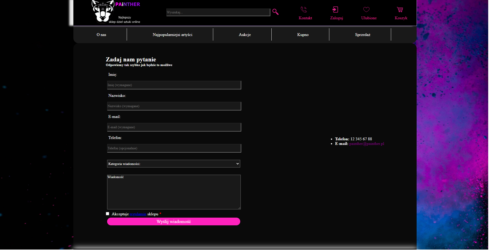
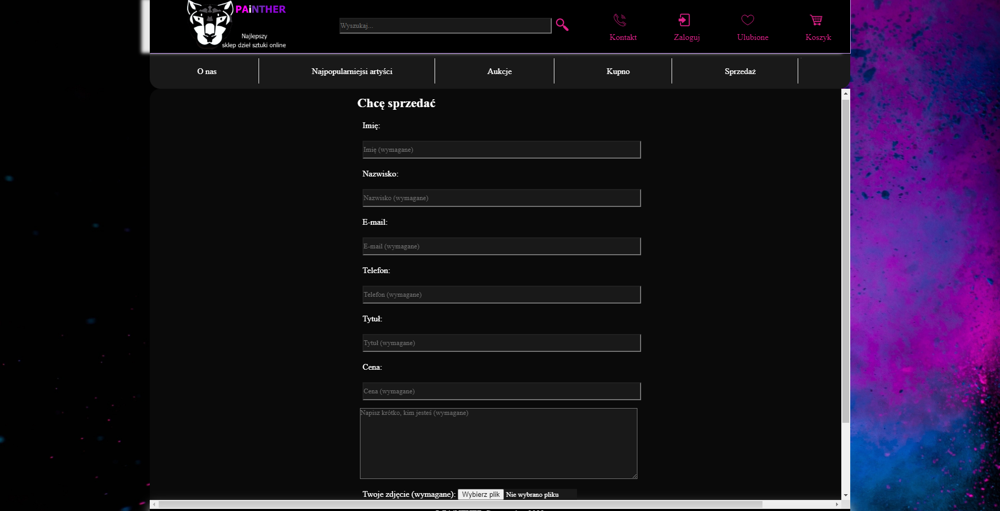
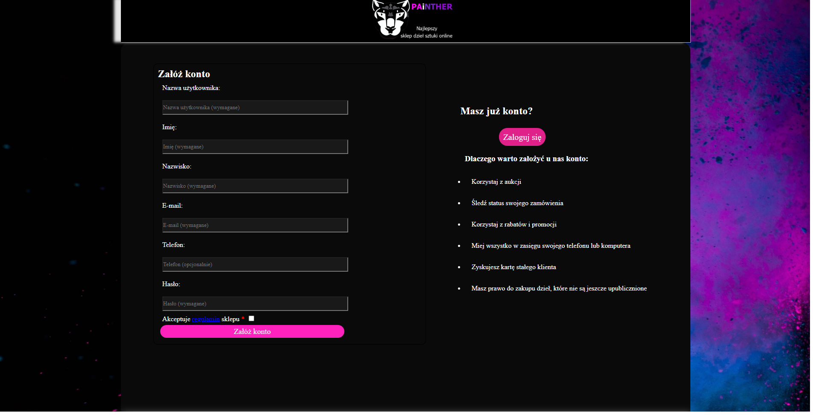
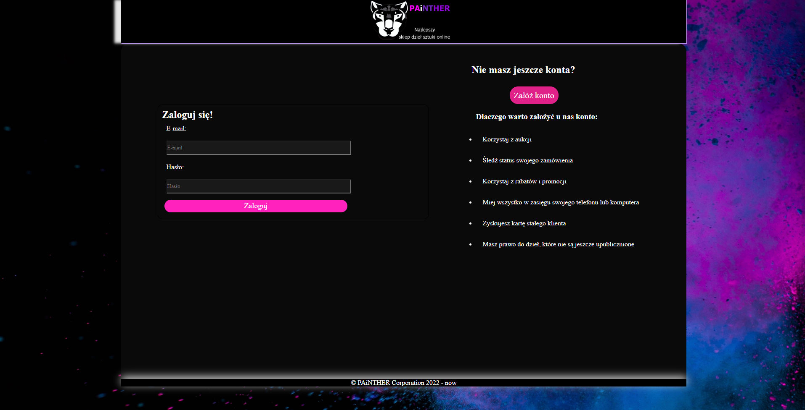

# 🛍️ Online Shop Concept

Prosty **koncept strony sklepu internetowego** z layoutem zgodnym z typowymi ścieżkami użytkownika: od strony głównej, przez rejestrację i logowanie, aż po widok sprzedaży.

---

## 🧰 Technologie

Projekt został zbudowany przy użyciu:
- **HTML** – struktura strony
- **CSS** – stylizacja wyglądu
- **PHP** – obsługa podstawowych formularzy i logiki serwera dla rejestracji i sprzedaży

---

## 📸 Zrzuty ekranu

1. **Strona główna**  
   
2. **O nas**  
   
3. **Kontakt**  
   
4. **Sprzedaż (Sell)**  
   
5. **Rejestracja**  
   
6. **Logowanie**  
   

> Powyższe pliki znajdziesz w folderze `online_shop/`. Jeśli mają inne nazwy lub ścieżki, zmień linki powyżej.

---

## 📂 Struktura projektu

OnlineShopConcept/
├── online_shop/ # główny folder z layoutem sklepu
│ ├── css/ # style CSS
│ ├── images/ # grafiki i zdjęcia
│ ├── index.php # strona główna
│ ├── about_us.php
│ ├── contact.php
│ ├── sell.php
│ ├── register.php
│ └── login.php
├── photo_website/ # (opcjonalnie) inne zasoby z projektów
└── README.md # ten plik

---

## 🚀 Jak uruchomić lokalnie

Projekt wymaga **serwera z obsługą PHP**, np. XAMPP, MAMP lub wbudowanego PHP.

1. Sklonuj repozytorium:
   ```bash
   git clone https://github.com/MatWojek/OnlineShopConcept.git

2. Skopiuj folder online_shop/ do katalogu serwera, np. htdocs/online_shop/.

3. Uruchom serwer lokalny.

4. Otwórz przeglądarkę i wejdź pod: http://localhost/online_shop/

## Funkcjonalności (concept)

- Proste formularze rejestracji i logowania użytkownika (frontend + wstępna walidacja po stronie PHP)

- Formularz kontaktowy na stronie "Contact"

- Strona "Sell" jako przykładowe dodawanie produktów (formularz)

- Responsywność layoutu przy użyciu CSS

---

## 👤 Autor

MatWojek
